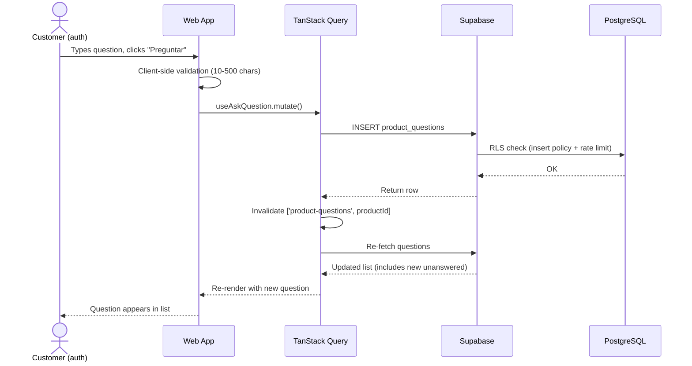
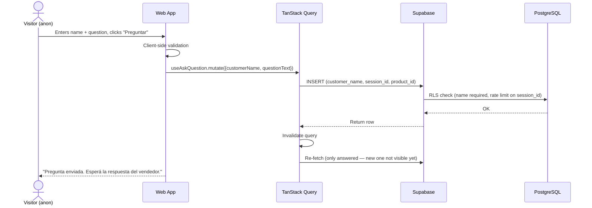
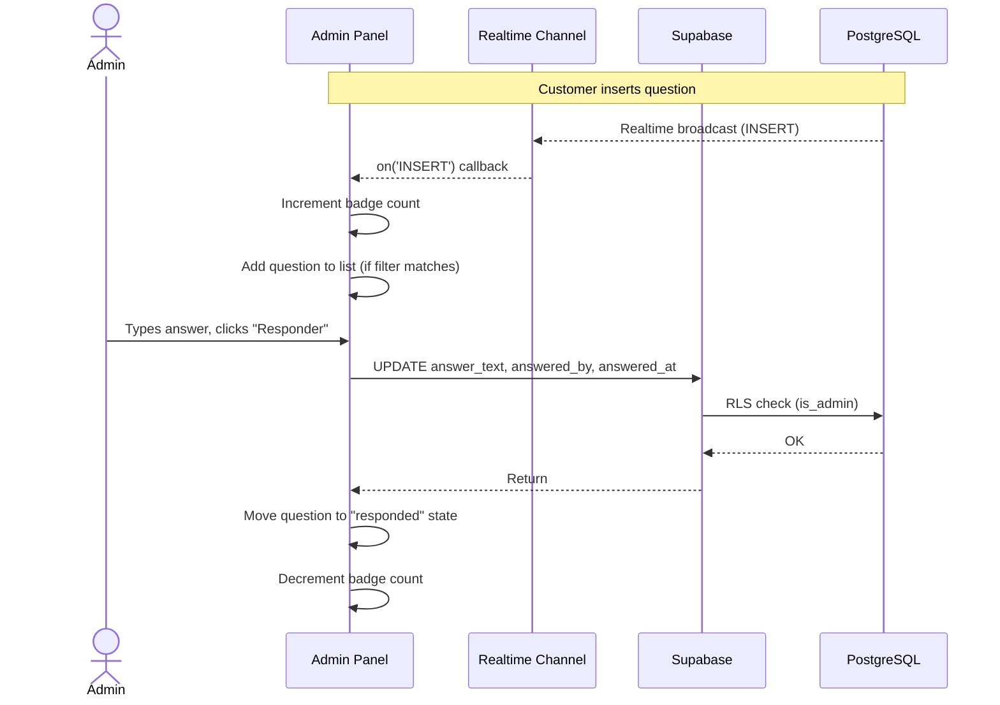
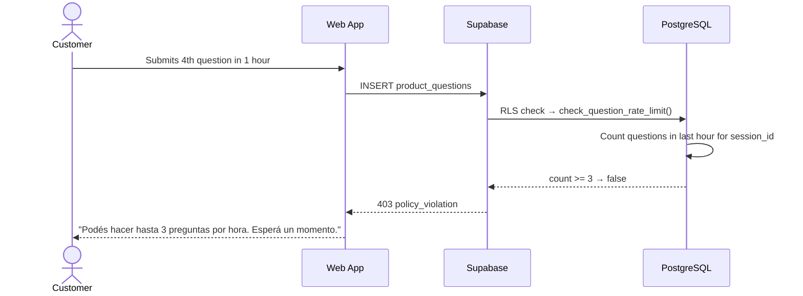

# Design: Product Q&A (Preguntas al Vendedor)

## Technical Approach

Add a `product_questions` table with RLS-based access control and rate limiting. Web and mobile use TanStack Query for data fetching with the existing query/hook pattern. Admin gets a realtime subscription for live badge updates. Shared Zod schemas in `@mbt/shared` for validation across all surfaces.

## Architecture Decisions

### Decision: `product_questions` table vs embedded JSON in products

| Option | Tradeoff |
|--------|----------|
| Separate table | Normalized, indexable, RLS-per-row, realtime per row, paginable |
| JSONB array on products | No RLS granularity, no realtime per question, no pagination, update conflicts |

**Choice**: Separate `product_questions` table. **Rationale**: RLS per-row is required (answered vs unanswered visibility). Realtime per-row for admin notifications. Pagination for products with many questions.

### Decision: RLS for rate limiting vs Edge Function

| Option | Tradeoff |
|--------|----------|
| RLS check on INSERT | Atomic, no extra HTTP hop, no cold start, consistent with existing pattern |
| Edge Function | Cold starts, extra latency, separate auth handling, more surface area |

**Choice**: RLS-based rate limiting via a `check_question_rate_limit()` function. **Rationale**: Atomic with the insert, zero additional infrastructure, follows the existing pattern of DB-level enforcement. The function counts rows in `product_questions` where `session_id` or `customer_id` matches and `created_at > now() - interval '1 hour'`.

### Decision: TanStack Query vs direct Realtime subscription for question list

**Choice**: TanStack Query for question list, Realtime only for admin badge count. **Rationale**: Questions change infrequently (answered by admin). TanStack Query's stale-while-revalidate + mutation invalidation is sufficient. Realtime subscription is reserved for the admin badge where live count matters.

### Decision: Anonymous vs authenticated question model

**Choice**: Anonymous users provide `customer_name` (required when `customer_id` is NULL). Authenticated users omit name (derived from `customers` table). **Rationale**: Lowers friction for first-time visitors. No auth wall for asking. Name spoofing is acceptable — the value is public display only.

## Database Design

### Migration: `00014_product_questions.sql`

```sql
-- =============================================================
-- M&B Trend — Product Q&A
-- Migration: 00014_product_questions.sql
-- Description: product_questions table, RLS, rate limiting,
--              indexes, and realtime publication
-- =============================================================

-- 1. PRODUCT QUESTIONS TABLE
create table product_questions (
  id            uuid primary key default gen_random_uuid(),
  product_id    uuid not null references products(id) on delete cascade,
  customer_id   uuid references customers(id) on delete set null,
  customer_name text,
  question_text text not null check (char_length(question_text) >= 10),
  answer_text   text,
  answered_by   uuid references auth.users(id) on delete set null,
  answered_at   timestamptz,
  is_visible    boolean not null default true,
  session_id    text,
  created_at    timestamptz not null default now(),
  updated_at    timestamptz not null default now(),
  constraint chk_customer_name_required
    check (customer_id is not null or (customer_name is not null and customer_name <> ''))
);

comment on table product_questions is 'Public Q&A per product — customers ask, admins answer';
comment on column product_questions.customer_name is 'Display name for anonymous questions; required when customer_id is null';
comment on column product_questions.session_id is 'Anonymous session identifier for rate limiting';
comment on column product_questions.is_visible is 'Admin toggle to hide inappropriate questions';

-- 2. TRIGGER: auto-update updated_at
create trigger trg_product_questions_updated_at
  before update on product_questions
  for each row
  execute function set_updated_at();

-- 3. INDEXES
create index idx_pq_product_created on product_questions (product_id, created_at desc);
create index idx_pq_session_rate on product_questions (session_id, created_at);
create index idx_pq_customer_rate on product_questions (customer_id, created_at);

-- 4. RATE LIMIT FUNCTION
-- Returns true if the session/customer has fewer than 3 questions in the last hour
create or replace function public.check_question_rate_limit(session_id text, customer_id uuid)
returns boolean
language plpgsql
stable
as $$
declare
  recent_count int;
begin
  if customer_id is not null then
    select count(*) into recent_count
    from product_questions
    where customer_id = check_question_rate_limit.customer_id
      and created_at > now() - interval '1 hour';
  else
    select count(*) into recent_count
    from product_questions
    where session_id = check_question_rate_limit.session_id
      and created_at > now() - interval '1 hour';
  end if;
  return recent_count < 3;
end;
$$;

comment on function public.check_question_rate_limit is 'Returns true if the session/customer has fewer than 3 questions in the last hour';

-- 4. RLS
alter table product_questions enable row level security;

-- Policy 1: Anyone can read answered questions
create policy "Anyone can read answered questions"
  on product_questions for select
  using (answer_text is not null and is_visible = true);

-- Policy 2: Authenticated users can read their own unanswered questions
create policy "Users can read own unanswered questions"
  on product_questions for select
  using (customer_id = auth.uid() and answer_text is null);

-- Policy 3: Anyone can insert (with rate limit + name check)
create policy "Anyone can insert questions"
  on product_questions for insert
  with check (
    -- Must pass rate limit
    check_question_rate_limit(
      coalesce(session_id, ''),
      customer_id
    )
    -- Must have customer_name if anonymous
    and (customer_id is not null or (customer_name is not null and customer_name <> ''))
    -- Must have valid product_id
    and product_id is not null
    -- Must have question_text >= 10 chars (enforced by check constraint)
  );

-- Policy 4: Admin can update answers and visibility
create policy "Admin can answer questions"
  on product_questions for update
  using (is_admin())
  with check (is_admin());

-- 5. REALTIME PUBLICATION
alter publication supabase_realtime add table product_questions;

-- 6. GRANTS
grant select on product_questions to anon, authenticated;
grant insert on product_questions to anon, authenticated;
grant update on product_questions to authenticated;
```

### RLS Policy Rationale

| Policy | Why |
|--------|-----|
| `Anyone can read answered questions` | Public answered Q&A is the core value — every visitor sees answers. `is_visible` allows admin to hide inappropriate content. |
| `Users can read own unanswered questions` | Authenticated users need to see their pending questions. Combined with the first policy via OR in the application query. |
| `Anyone can insert questions` | Low friction. Rate limit prevents spam. Name check prevents anonymous-without-name. |
| `Admin can answer questions` | Only admins can write answers. Uses existing `is_admin()` function from migration 00003. |

## Data Flow

```
Customer (Web/Mobile)          Supabase DB            Admin Panel
       │                           │                      │
       │── INSERT question ───────→│                      │
       │                           │── Realtime broadcast ─┤
       │                           │                      │── Badge +1
       │                           │                      │
       │                           │                      │── UPDATE answer
       │                           │←── answer_text ──────│
       │←── answered question ─────│                      │
       │   (via query refetch)     │                      │
```

## File Changes

| File | Action | Description |
|------|--------|-------------|
| `supabase/migrations/00014_product_questions.sql` | Create | Table, RLS, rate limit function, indexes, realtime |
| `packages/shared/src/types/product-questions.ts` | Create | `ProductQuestion`, `CreateQuestionInput`, `AnswerInput` + Zod schemas |
| `packages/shared/src/types/index.ts` | Modify | Export new types |
| `packages/web/src/features/catalog/api/queries.ts` | Modify | Add `getProductQuestions`, `createQuestion`, `getAdminQuestions`, `answerQuestion` |
| `packages/web/src/features/catalog/hooks/use-product-questions.ts` | Create | `useProductQuestions`, `useAskQuestion` hooks |
| `packages/web/src/features/catalog/components/product-questions.tsx` | Create | Q&A section component (list + form) |
| `packages/web/src/features/catalog/pages/product-detail-page.tsx` | Modify | Import and render `<ProductQuestions />` below add-to-cart |
| `packages/web/src/features/admin/api/use-admin-questions.ts` | Create | `useAdminQuestions`, `useAnswerQuestion`, `useUnansweredCount` hooks |
| `packages/web/src/features/admin/pages/QuestionsPage.tsx` | Create | Admin questions list with filters + answer form |
| `packages/web/src/features/admin/components/QuestionsNavBadge.tsx` | Create | Realtime badge for nav |
| `packages/web/src/features/admin/index.ts` | Modify | Export new pages |
| `packages/web/src/router.tsx` | Modify | Add `/admin/preguntas` route |
| `packages/mobile/src/features/catalog/api/queries.ts` | Modify | Add question queries |
| `packages/mobile/src/features/catalog/hooks/use-product-questions.ts` | Create | Mobile question hooks |
| `packages/mobile/src/features/catalog/components/ProductQuestionsSheet.tsx` | Create | Bottom sheet Q&A component |
| `packages/mobile/src/features/catalog/index.ts` | Modify | Export new hooks/components |

## Interfaces / Contracts

```typescript
// packages/shared/src/types/product-questions.ts
import { z } from 'zod';

export interface ProductQuestion {
  id: string;
  productId: string;
  customerId?: string;
  customerName?: string;
  questionText: string;
  answerText?: string;
  answeredBy?: string;
  answeredAt?: string;
  isVisible: boolean;
  createdAt: string;
  updatedAt: string;
}

export const CreateQuestionSchema = z.object({
  productId: z.string().uuid(),
  questionText: z.string().min(10).max(500),
  customerName: z.string().min(1).max(100).optional(),
});

export const AnswerSchema = z.object({
  questionId: z.string().uuid(),
  answerText: z.string().min(10).max(1000),
});

export type CreateQuestionInput = z.infer<typeof CreateQuestionSchema>;
export type AnswerInput = z.infer<typeof AnswerSchema>;
```

## Component Tree

```
ProductDetailPage
├── <SEO />
├── <Breadcrumbs />
├── Image gallery
├── Product info + add-to-cart
└── <ProductQuestions productId={product.id} />
    ├── <h2>Preguntas y Respuestas</h2>
    ├── <QuestionList>
    │   ├── <QuestionItem /> (answered only, newest first)
    │   ├── <Skeleton /> (loading)
    │   └── <EmptyState /> (no questions)
    └── <AskQuestionForm>
        ├── <input name /> (anonymous only)
        ├── <textarea question />
        └── <button> Preguntar

AdminQuestionsPage
├── <FilterBar /> (todos / sin responder / respondidos)
├── <QuestionList>
│   ├── <QuestionCard /> (desktop: table, mobile: card)
│   │   └── <AnswerForm /> (inline for unanswered)
│   └── <EmptyState />
└── <QuestionsNavBadge /> (realtime, in nav sidebar)
```

## Sequence Diagrams

### Customer asks question (authenticated)



### Anonymous customer asks question



### Admin receives and answers question (realtime)



### Rate limit exceeded



## Testing Strategy

| Layer | What to Test | Approach |
|-------|-------------|----------|
| Unit | Zod schemas (CreateQuestionSchema, AnswerSchema) | Validate valid/invalid inputs, boundary values (9, 10, 500, 501 chars) |
| Unit | `mapProductQuestion` mapper | DB row → domain type conversion |
| Integration | RLS policies | Supabase local tests: anon SELECT, auth SELECT own, anon INSERT, rate limit |
| Integration | Question queries + mutations | Test with Supabase local: fetch, create, answer |
| E2E | Web Q&A flow | Playwright: visit product, ask question, verify list |
| E2E | Admin answer flow | Playwright: login as admin, navigate to /admin/preguntas, answer, verify badge |

## Migration / Rollout

No migration required for existing data. The `product_questions` table is additive — no schema changes to existing tables. Rollback: `supabase migration repair --status reverted 00014` + delete file.

## Open Questions

- [ ] Should `session_id` be generated client-side (crypto.randomUUID) or server-side? Client-side is simpler but spoofable — acceptable for rate limiting since it only limits, not authorizes.
- [ ] Confirm admin nav structure — does the sidebar support dynamic badge components or is it static?

## Architecture Decisions (ADRs)

### ADR 1: RLS for rate limiting vs Edge Function

**Context**: Need to limit anonymous question submissions to 3/hour. Two approaches: RLS function or Edge Function middleware.

**Decision**: RLS-based rate limiting via `check_question_rate_limit()` function called in the INSERT policy's `with check`.

**Consequences**:
- (+) Atomic with the insert — no race condition between check and insert
- (+) Zero additional infrastructure — no Edge Function cold starts
- (+) Consistent with existing pattern (all logic in DB)
- (-) Slightly more complex RLS policy
- (-) Cannot return a user-friendly error message (Supabase returns generic 403)

### ADR 2: Separate query functions vs inline in hooks

**Context**: Web and mobile both need question queries. The existing pattern separates raw Supabase queries (`api/queries.ts`) from TanStack Query hooks (`hooks/`).

**Decision**: Follow the existing pattern — query functions in `api/queries.ts`, hooks in `hooks/use-product-questions.ts`.

**Consequences**:
- (+) Consistent with codebase conventions
- (+) Query functions are testable independently of React
- (+) Hooks are thin wrappers — easy to reason about

### ADR 3: Optimistic updates for ask question

**Context**: When a user submits a question, should it appear immediately (optimistic) or after refetch?

**Decision**: No optimistic update. The question only appears after the mutation succeeds and the query refetches. For anonymous users, the question won't appear at all (only answered questions are visible). For authenticated users, the refetch includes their unanswered question.

**Consequences**:
- (+) Simpler code — no rollback logic
- (+) Honest UX — anonymous users see "Pregunta enviada" message, not a fake entry
- (-) Slight delay for authenticated users seeing their question in the list
